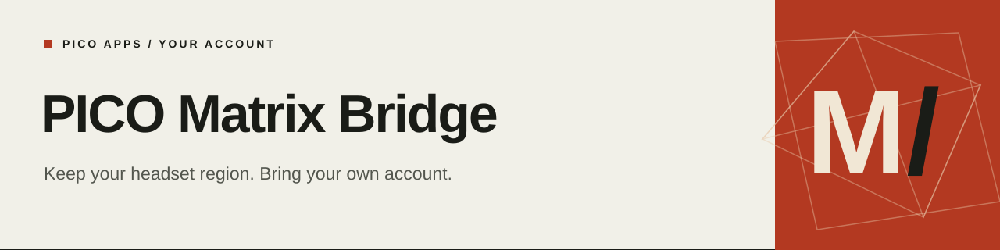

# PICO Matrix Bridge

[](https://github.com/nkanf-dev/pico-matrix-bridge/actions/workflows/check.yml)
[](LICENSE)

[简体中文](README.zh-CN.md) · [PICO Store Lab](https://github.com/nkanf-dev/pico-store-lab) · [Integration guide](docs/integration.md)

Use your PICO international account in supported apps on a China-region headset, without changing the headset region or requiring root.

Matrix Bridge works with apps that use the PICO Platform SDK. It prepares an installable copy with the compatibility runtime included, then lets the app run with your own account.

## With PICO Store Lab

The Android integration brings preparation and account setup into the normal download and install flow:

1. Sign in to PICO Store Lab with your PICO international account.
2. Choose an app and download it.
3. Choose the adapted copy when offered, then confirm installation. Apps with a matching profile are ready to adapt from their detail page.
4. Open the app. Your signed-in account is carried across; you can also sign in inside the app.

The [development guide](docs/development.md) explains how to build Lab with the integration. For paid apps, use an account that owns the app.

## Application support

**Virtual Desktop for PICO 1.34.22.0** has an application profile covering installation, account access and desktop connection.

Other apps go through automatic detection. Apps without Matrix dependencies install as usual; recognized Matrix integrations can use the generic profile. You can also choose the original app. More specific profiles handle cases that need additional changes. If an app needs support, include its name, version, headset model and the behavior you encountered in an issue.

## Build and integrate

Requirements: JDK 17, Python 3.12+ and the Android SDK.

```sh
./scripts/verify.sh
```

To build a compatibility bundle and the integrated Lab APK, follow [development and builds](docs/development.md). To use the components in another Android installer, see [host integration](docs/integration.md).

| Component | Purpose |
|---|---|
| `adapter-core` | Detect apps and prepare compatible APKs on Android or the JVM |
| `account-android` | Sign in and carry the account into an installed app |
| `installer-android` | Sign prepared copies, install them and restore interrupted work |
| `embedded-bootstrap` and `runtime` | Run the compatibility layer inside the target app |
| `tools`, `scripts` and `profiles` | Extract protocols and maintain application support |

## Maintaining support

[The maintenance guide](docs/maintenance.md) covers protocol changes, application profiles and repeatable builds. Profiles identify the source version and the changes to apply, so updates use the same preparation pipeline.

## License

[MIT](LICENSE) for this project's source code. Third-party applications and dependencies retain their respective licenses.
