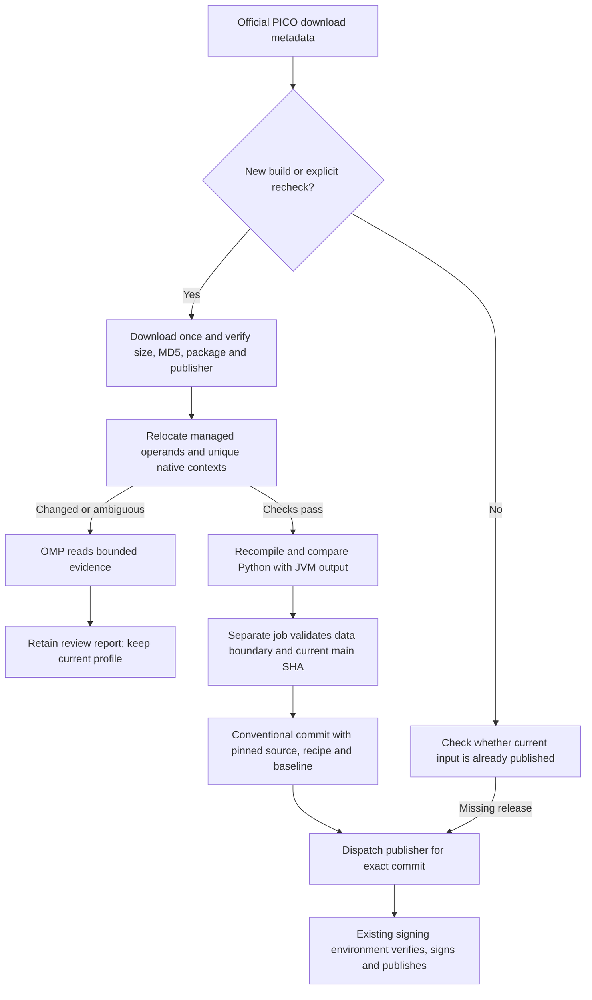

# Continuous VD profile adaptation

`Adapt new VD builds` checks the official download metadata every six hours. An unchanged build only runs the metadata job; it does not download an APK, compile Android code or call a model. New builds run on disposable GitHub-hosted runners. The current profile remains available throughout analysis.

## Flow



The automatic path only changes input hashes, version metadata and checked operand locations. It preserves the package strategy, original certificate, loader, method selectors, constant values, expected call sites and patch counts. The compiler retains its existing original-byte and structural checks. The JVM differential checks cover all 185 assemblies and the routed loader/native library against the Python reference.

The baseline hashes five scoped managed methods, including instruction operands, referenced types/assemblies, local signatures, method headers and exception handlers. Each native comparison must have one matching 22-instruction context. Register choices, virtual call slots, comparison values and branch direction/distance are retained; direct-call addresses and recognized PC-relative page/load addresses are normalized. A context match is a deliberately conservative relocation rule, not whole-program semantic equivalence. A new loader, Java code/resource change, ambiguous native match or changed gate stops automatic publication. Review the retained evidence and update trusted rules when necessary.

## Agent

The runtime is OMP `18.1.17` with `mikumiku-openai/glm-5.3-flash` using the configured OpenAI-compatible endpoint. Normal data-only relocation makes no model call. A failed relocation invokes the agent once to diagnose the supplied evidence and record a candidate mapping or review requirement. A model's equivalence claim never overrides a failed deterministic check. Changes to the adapter algorithm are reviewed code changes, not model-authorized releases.

OMP runs with an isolated home, no sessions, rules, skills, LSP, PTY or built-in tools. Its explicit extension provides only `read_evidence` and `submit_candidate`. It has at most 12 tool executions, 4,096 output tokens per response and a 180-second agent budget (210-second process cutoff). It receives no PICO session, GitHub write token or signing variables. Its raw traces are discarded. Only a bounded structured report is retained.

## Credentials

The `vd-adaptation` GitHub environment is restricted to the `main` branch:

- `PICO_AUTH_JSON`: SDK session for an account that owns VD. CI does not purchase anything. Session expiry stops acquisition and requires renewed sign-in.
- `MIKUMIKU_API_KEY`: provider key from the maintainer's OMP configuration.

Use `scripts/adaptation/configure_secrets.py` locally to copy the native SDK session and the configured OMP key directly into GitHub environment secrets, without printing their values. The model key is not provided to the cheap metadata job. The existing `profile-publishing` environment retains the signing key; neither analysis nor promotion receives it. The analysis jobs have no repository write permission. Promotion accepts only the known JSON artifact names, checks their digests/invariants and rejects a changed main branch. It never runs model-generated code.

## Manual operation

```sh
# Cheap observation; no commit or release.
gh workflow run adapt-vd.yml -f dry_run=true

# Full current-build rehearsal, including a real model tool loop; no release.
gh workflow run adapt-vd.yml -f dry_run=true -f recheck_current=true -f force_agent=true

# Retry acquisition/analysis and enable publication after trusted fixes.
gh workflow run adapt-vd.yml -f dry_run=false -f recheck_current=true
```

A previously rejected build is recognized from retained review artifacts and is not repeatedly downloaded or sent to the model. Explicit rechecks bypass that suppression. Reports are retained for 14 days; after expiration a still-unhandled build can be inspected again. Session/network failures remain failures rather than being cached as successful observations.

Publication is serialized, uses a non-force push, and checks that the report belongs to the current main commit. If main changes, rerun against the new head. If signing fails after the data commit, a later unchanged observation dispatches signing again for the current pinned input. Existing releases are identified by the input hash in their release notes. The publisher binds `expected_sha` to the actual dispatch commit.

## Local reproduction

```sh
python3 -m pip install -r scripts/adaptation/requirements.txt
./gradlew :tools:installDist
python3 scripts/adaptation/run.py --apk /path/to/licensed-vd.apk \
  --work /path/to/research/run.work --output /path/to/research/result
```

Input APKs are read in place. CI streams one original APK, caps it at 2 GiB, extracts only analysis inputs, and removes them at completion. No original/repacked VD APK, private key, login session or signed download URL is uploaded. Artifacts contain the candidate recipe, small baseline and verification report. A source update currently advances the active VD recipe; older pinned source JSONs and historical signed profile releases remain available.

The initial acceptance replay uses `VD_REPLAY_OLD_APK` (10703) and `VD_REPLAY_NEW_APK` (10709) with `python -m unittest discover -s scripts/tests -p test_adaptation.py -v`. It must reproduce the reviewed source JSON and recipe operands exactly. No headset is needed for that static/differential acceptance test.
